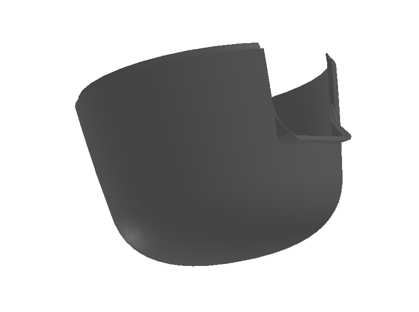
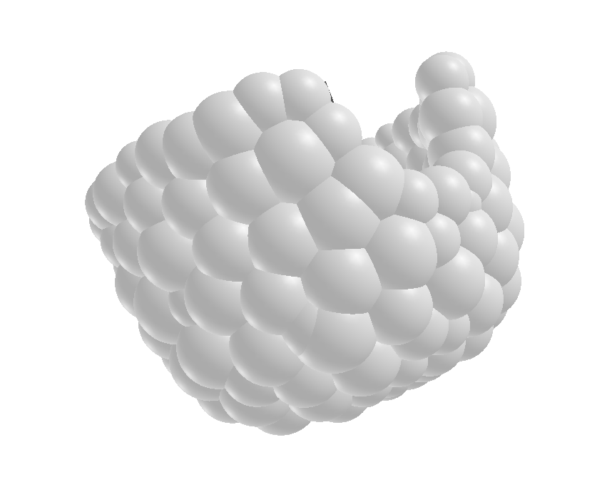
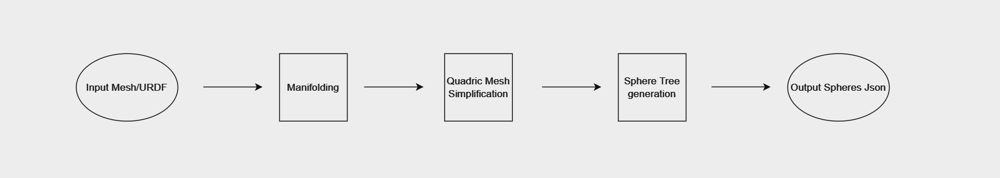

# Foam: Spherical Approximations of URDFs
<p align="center">
  
  
</p>


## Installation
:warning: Work in Progress :warning:

Install foam by using the command:
`pip install foam`

Install for editable development by running the following command from the root directory of the foam repository:
`pip install -e .`

## Obtaining & Building Dependencies 
```sh
git clone --recursive git@github.com:CoMMALab/foam.git
cd foam
cmake -Bbuild -GNinja .
cmake --build build/
```


## Using Scripts

In the `scripts` directory:

- `python generate_spheres.py <mesh>`: creates spheres.
  Specify `<mesh>` with the path to the mesh file that will be spherized.
  
  Optionally specify `--depth <depth>` and `--branch <branching factor>` to control sphere generation process.
  
  Optionally specify `--manifold-leaves <leaves>` to control mesh correction on invalid meshes.
  
  Valid mesh formats include `.DAE`, `.STL`, and `.OBJ`.
- `python generate_sphere_urdf.py <urdf>`: creates spheres.
- Specify `<urdf>` with the path to the urdf file that will be spherized.
- 
  Optionally specify `--depth <depth>` and `--branch <branching factor>` to control sphere generation process.
  
  Optionally specify `--manifold-leaves <leaves>` to control mesh correction on invalid meshes.
  
  Takes urdfs as input rather than mesh formats.
- `python visualize_spheres.py <mesh> <spheres>`: visualizes spheres and mesh.
  Specify `<mesh>` with the path to the original mesh file.
  Optionally specify `<spheres>` to visualize the spherized approximation on top of the original mesh.
  Optionally specify `--depth <depth>` for the sphere level to visualize.

## Third-party Dependencies

Third-party dependencies are stored in the `./external` directory.
Compiled script binaries are copied into the `foam/external` directory.


#### [Manifold](https://github.com/hjwdzh/Manifold)/[ManifoldPlus](https://github.com/hjwdzh/ManifoldPlus)
Manifold is used to ensure mesh data format and convert a triangle mesh `.obj` file into a manifold `.obj` file. Manifolding creates a continuous surface without gaps to avoid dynamics and collision issues. ManifoldPlus performs the same functionality with an advanced algorithm. Manifold code is included as a compiled submodule. ManifoldPlus code is included as a submodule.

#### [Quadric Mesh Simplification](https://github.com/sp4cerat/Fast-Quadric-Mesh-Simplification)
Quadric Mesh Simplification reduces the complexity of the generated manifold file as a preprocessing step before spherization. This code is included as a submodule.

#### [SphereTree](https://github.com/mlund/spheretree)
The code in the `./spheretree` directory has been copied from the linked directory and modified to build on modern systems with `CMake` rather than `autotools`. SphereTree has a variety of algorithms to construct sphere-tree representations of polygonal models, but foam currently uses the MedialTree algorithm for SphereTree generation. The output is formatted and dumped into an output file.


